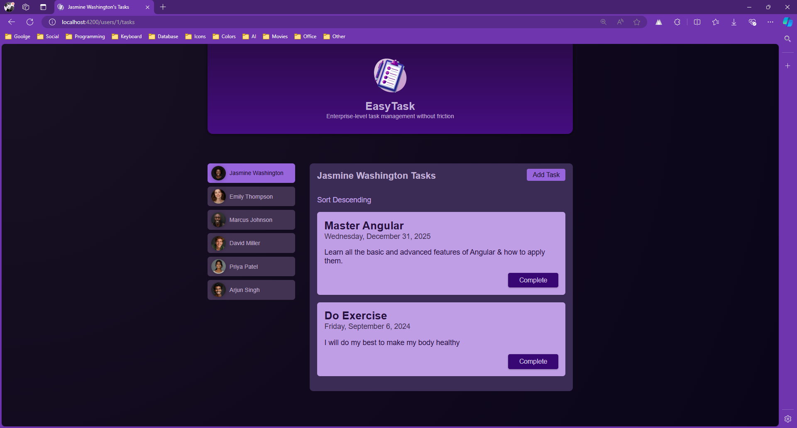
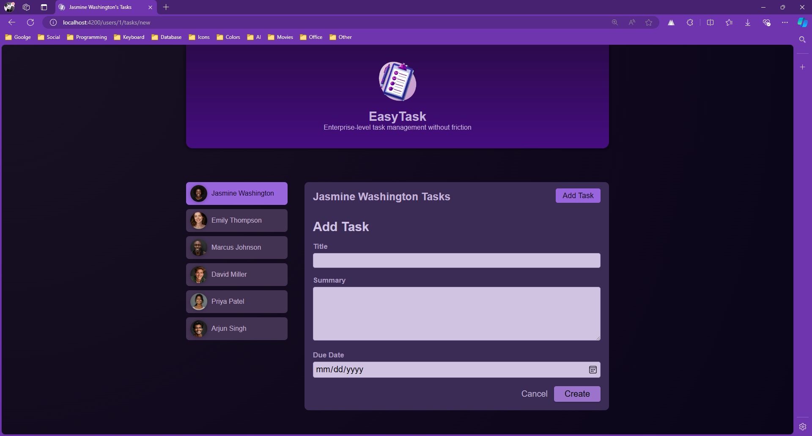

# TaskMate

**TaskMate** is an enterprise-level task management application designed to simplify task organization and enhance productivity. It features a sleek, modern design and offers robust functionality for managing tasks efficiently.

## Features

- **User Management**: Easily manage users with a dedicated user component.
- **Task Management**: Create, view, and manage tasks seamlessly.
- **Two-Way Data Binding**: Utilize Angular's two-way data binding for form inputs.
- **Content Projection**: Leverage `ng-content` for flexible component templates.
- **Date Formatting**: Format task due dates using Angular's date pipe.
- **Dependency Injection and Services**: Manage tasks through Angular services.
- **Modular Architecture**: Structured with Angular modules for scalable development.

## Setting Up

To get started with this repository:

1. Clone the repository to your local machine.
   - `git clone https://github.com/dev-khaled-yousef/task-mate.git`

2. Install dependencies using npm.
   - `npm install`
   
   This will install all necessary packages and dependencies required for the Angular projects.

3. Start the development server.
   - `npm start`
   
   This command will compile the application and open it in your default web browser. If it doesn't open automatically, you can navigate to http://localhost:4200/ in your browser.

## Screenshots

Here are some screenshots of the application:

### Main Interface

### Add Task Dialog

## Usage

- **Add a Task**: Use the "Add Task" button to create new tasks.
- **Complete a Task**: Mark tasks as complete by clicking the "Complete" button.
- **User Selection**: Switch between different users to manage their tasks.

Feel free to contribute to the project by opening issues or submitting pull requests. For any queries, contact us at `khalidsliman2014@gmail.com`.

